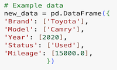
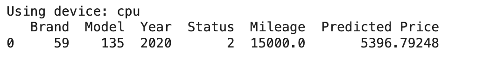

## Overview

This project aims to predict the price of used cars based on various features like brand, model, year, mileage, and status. The prediction model is built using a neural network in PyTorch, and the data preprocessing is handled with scikit-learn.

## Project Structure
```plaintext
car_price_prediction/
│
├── data/
│   └── cars.csv                     	  # Original dataset
│
├── models/
│   ├── car_price_model.pth         	  # Saved model state dictionary
│   ├── scaler_X.pkl                	  # Saved X scaler (MinMaxScaler for features)
│   ├── scaler_y.pkl                	  # Saved y scaler (MinMaxScaler for target)
│   ├── Model_encoder.pkl         	  # Saved encoder (encoder for car model)
│   ├── Brand_encoder.pkl            	  # Saved encoder (encoder for car brand)
│   └── Status.pkl              	  # Saved encoder (encoder for car status)
│
├── src/
│   ├── train.py                          # Script for training the model
│   ├── predict.py                        # Script for making predictions
│   └── model.py                          # Model definition (PyTorch neural network)
│
├── notebooks/
│   └── Used_Car_Price_Estimation.ipynb   # Jupyter notebook for data exploration and preprocessing
│
└── README.md                             # Project overview and instructions
```

## Requirements

- Python 3.7+
- PyTorch
- scikit-learn
- pandas
- joblib (optional, for saving and loading scalers)
- Jupyter Notebook (optional, for data exploration)

You can install the necessary packages using the following command:

```bash
pip install torch scikit-learn pandas joblib
```

## How to Run

### 1. Data Exploration

Before training the model, you can explore the dataset using the Jupyter notebook provided:

```bash
jupyter notebook notebook/Used_Car_Price_Estimation.ipynb
```

### 2. Training the Model
To train the model, run the train.py script:

```bash
python src/train.py
```

This script will:

- Load the data from data/car.csv.
- Encode categorical variables and normalize the features using MinMaxScaler.
- Train a neural network model using PyTorch.
- Save the trained model and scalers in the models/ directory.

### 3. Making Predictions
To make predictions using the trained model, run the predict.py script:

```bash
python src/predict.py
```

This script will:

- Load the saved model and scalers from the models/ directory.
- Preprocess the input data in the same way as the training data.
- Output the predicted price for the given car features.

### 4. Predict Results
Inputdata:


Results:

